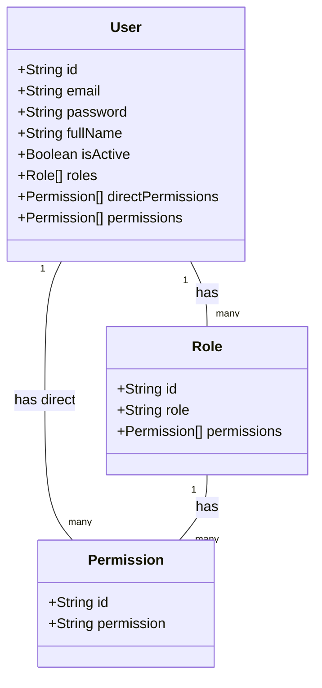

```mermaid
classDiagram
    class User {
        +String id
        +String email
        +String password
        +String fullName
        +Boolean isActive
        +Role[] roles
        +Permission[] directPermissions
        +Permission[] permissions
    }

    class Role {
        +String id
        +String role
        +Permission[] permissions
    }

    class Permission {
        +String id
        +String permission
    }

    User "1" -- "many" Role : has
    User "1" -- "many" Permission : has direct
    Role "1" -- "many" Permission : has
```